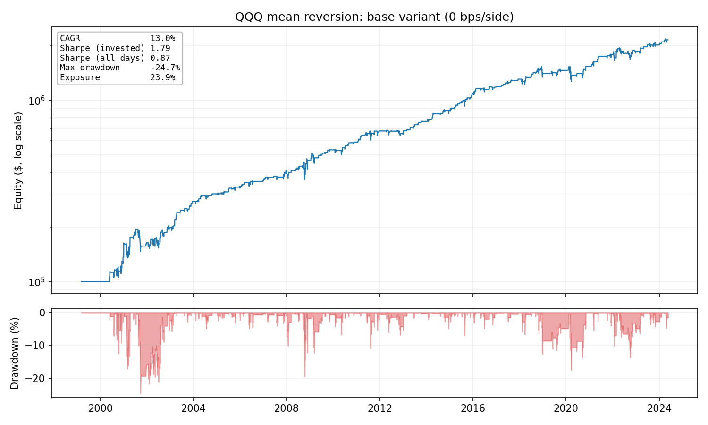
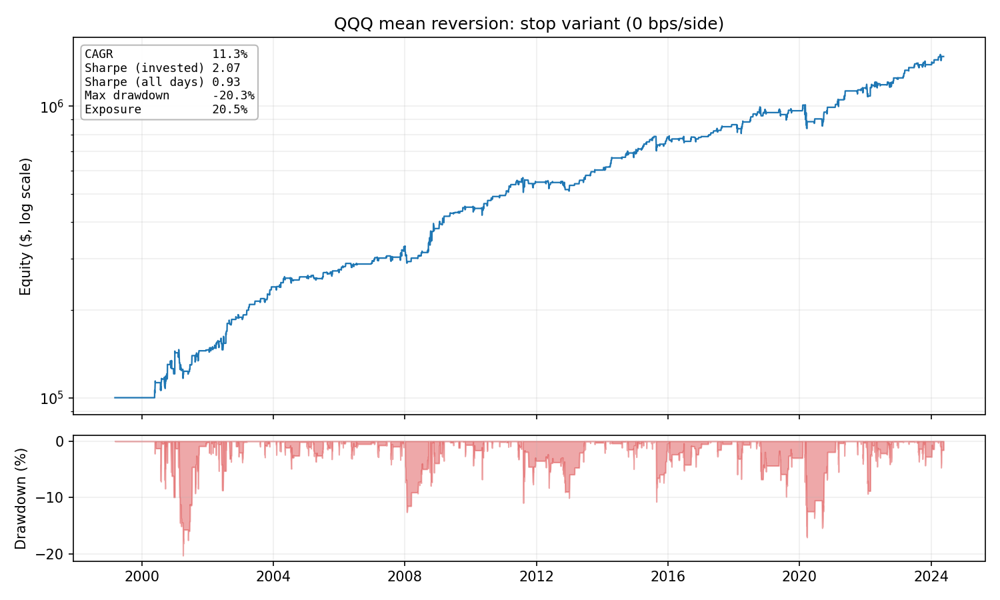
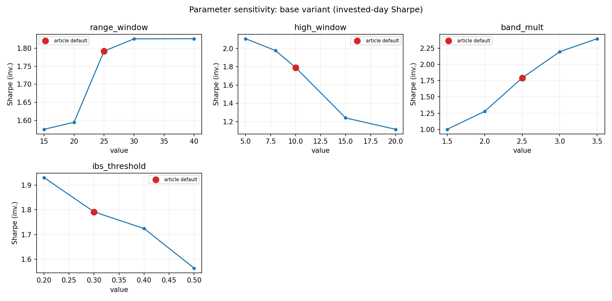

# Mean Reversion on QQQ: Replication and Stress Test

Replication of [*A Mean Reversion Strategy with 2.11 Sharpe*](https://www.quantitativo.com/p/a-mean-reversion-strategy-with-211)
(Quantitativo), extended with transaction costs, an out-of-sample split, a
parameter-sensitivity sweep, and a reconciliation of the Sharpe ratio.

The point is not the equity curve. It is an honest evaluation of a published
strategy: what the numbers are once costs, an out-of-sample split, and an
explicit Sharpe definition are put back in. The strategy rules are left exactly
as published; the contribution is the evaluation around them.

## Results

Original rules on QQQ, 1999-03 to 2024-05, no transaction costs:

| | Article | This replication |
|---|---|---|
| Annualised return | 14.6% | 13.0% |
| Max drawdown | -24.7% | -24.7% |
| Average drawdown | -2.8% | -2.6% |
| Exposure | 20.0% | 23.9% |
| Sharpe (invested-day basis) | 1.83 | 1.79 |

Returns and drawdowns line up closely. The small return shortfall comes from two
deliberate choices that make the backtest more realistic than the original
scripts: orders fill at the **next open** (no look-ahead) and the strategy never
pyramids. Both hold trades slightly longer, which lifts exposure a little
(23.9% vs 20.0%) and shaves compounding. The Sharpe matches once measured on the
same basis as the article; see [Reconciling the Sharpe ratio](#reconciling-the-sharpe-ratio).



### The three variants (0 bps)

The article builds three variants on the same rules. All are reproduced here as
one parameterised strategy (`base` / `regime` / `stop`).

| Variant | Article Sharpe | This repo (invested-day Sharpe) | Article Max DD | This repo Max DD |
|---|---|---|---|---|
| `base` (rules as published) | 1.83 | 1.79 | -24.7% | -24.7% |
| `stop` (dynamic stop below the 300-SMA) | 2.11 | 2.07 | -20.3% | -20.3% |
| `regime` (trade only above the 300-SMA) | 2.25 | 1.96 | -11.7% | -18.2% |

`base` and `stop` (the headline "2.11 Sharpe" strategy) reproduce the article
almost exactly, drawdown to the decimal. `regime` does not; that gap is
[diagnosed below](#why-regime-does-not-fully-reproduce), not tuned away.



### Sensitivity to transaction costs

Base variant. Costs in basis points per side; the article assumes ~1 bp of
slippage. Sharpe on the invested-day basis.

| Cost | CAGR | Sharpe (inv.) | Max DD | Trades |
|---|---|---|---|---|
| 0 bps | 13.0% | 1.79 | -24.7% | 305 |
| 1 bps | 12.7% | 1.76 | -24.8% | 305 |
| 2.5 bps | 12.3% | 1.71 | -24.8% | 305 |
| 5 bps | 11.6% | 1.63 | -24.9% | 305 |
| 10 bps | 10.3% | 1.46 | -25.0% | 305 |

The edge is real but not free: it survives the whole tested range (Sharpe never
goes non-positive), yet 10 bps per side already costs ~2.7 points of annualised
return and drops the Sharpe from 1.79 to 1.46. With ~300 short-held trades, cost
assumptions matter more than the headline number suggests.

### In-sample vs out-of-sample

The parameters, above all the 300-day SMA, were selected over the whole
history, so the headline numbers are in-sample by construction. Base variant,
split at 2019, at 5 bps:

| Period | CAGR | Sharpe (inv.) | Max DD | Trades |
|---|---|---|---|---|
| In-sample (<2019) | 12.9% | 1.74 | -24.9% | 239 |
| Out-of-sample (>=2019) | 7.2% | 1.43 | -14.5% | 56 |

The edge held up out-of-sample: lower, but positive and still respectable. Two
caveats keep this from being strong evidence: only 56 trades out of sample, and
the period overlaps a strong QQQ bull market.

## Parameter sensitivity

The article chose its five parameters by "trying 4-5 options" over the whole
history. So the real question is not whether they are optimal, but whether the
edge *depends* on them. Each parameter is swept one at a time around its default,
holding the others fixed (base variant, 0 bps, invested-day Sharpe):



Two things stand out, and both are reassuring rather than flattering:

- **No parameter peaks at the article's default.** On every knob, some *other*
  value would have scored a higher Sharpe; `band_mult` rises monotonically to
  2.40 at 3.5, shorter `high_window` scores higher, `range_window` 30-40 edges
  out 25. The published numbers are clearly not the output of a Sharpe hunt; if
  anything the defaults are conservative.
- **The genuinely fragile knob is `high_window`.** Lengthening the rolling-high
  lookback past 10 lowers the Sharpe *and* deepens the max drawdown sharply
  (-24.7% at the default, -36% at 15, -43% at 20). `band_mult` shows the classic
  trade-off: a wider band lifts the Sharpe but bleeds return and exposure.

The same sweep for `regime` and `stop` is in `Results/` (`--sensitivity`).

## Reconciling the Sharpe ratio

The gap between the article's 1.83 and a naive replication's ~0.7-0.9 is a
**measurement disagreement, not a data disagreement**: returns and drawdowns
match while the Sharpe is off by a factor of two.

This repository reports three Sharpe numbers for the base variant, 0 bps, side
by side:

| Definition | Value |
|---|---|
| `backtesting.py` (annual return / annual vol, rf = 0): 12.97 / 17.46 | **0.74** |
| Hand-computed over every calendar day (mean/std of daily returns × √252) | **0.87** |
| Hand-computed over **invested days only** | **1.79** |

The strategy holds a position only ~24% of the time. The ~76% of flat days carry
a zero return, which pulls the measured volatility down when they are included
and inflates it away when they are not. The article's figures line up with the
invested-day basis (base 1.79 ≈ 1.83, stop 2.07 ≈ 2.11), so that is almost
certainly the convention it used. None of these numbers is "wrong", but the
headline "2.11 Sharpe" is a statement about invested days, not calendar days,
and that distinction is the whole story.

## Why `regime` does not fully reproduce

The regime filter goes to cash below the 300-SMA, so it should cap drawdowns. It
reproduces the article's Sharpe direction but its max drawdown is -18.2% against
the article's -11.7%. Diagnosis (parameters unchanged):

- The worst drawdown runs **Aug 2011 → Dec 2012**. Over that window the price is
  *below* the 300-SMA only **7%** of the time; it is a slow bleed of small
  losing trades in a market that is technically "bull", which the regime filter
  by design cannot prevent.
- It is not the SMA window: sweeping 150/200/250/300 days never reproduces the
  -11.7% / 2.25 pair.
- The residual traces to the same conventions as everywhere else: the engine is
  ~20% more exposed than the article (14.3% vs 11.7%) because of next-open fills
  and close-based exits. More time in the market picks up that 2011-12 bleed.

In short: not a bug and not a parameter choice, but the expected gap between an
optimistic backtest and one that refuses look-ahead.

## Strategy

Entry, exit and filter, exactly as in the article:

- **Entry**: `Close < rolling_high(10) - 2.5 * mean(High - Low, 25)` and `IBS < 0.3`,
  where `IBS = (Close - Low) / (High - Low)`
- **Exit**: `Close > ` yesterday's `High`
- **Variants**: `base` (rules as published), `regime` (trade only above the
  300-day SMA), `stop` (exit below the 300-day SMA)

Orders fill at the next open, per `backtesting.py`'s default. Entries are
skipped while a position is open, so the strategy never pyramids and never
opens and closes within one bar.

## Data and reproducibility

Prices are committed under `data/` (QQQ, split/dividend-adjusted). This is
deliberate, not an accident of a `.gitignore`: Yahoo revises its adjusted
history over time and rate-limits automated downloads, so a repo that
re-downloads on every clone would silently produce different numbers, or none.
Committing the ~0.6 MB cache is what makes every number here exactly
reproducible from a fresh clone. To pull a fresh copy instead, delete the CSV or
run with `--refresh` (needs `yfinance` and network access).

## Usage

```bash
python -m venv .venv && source .venv/bin/activate
pip install -r requirements.txt

python mean_reversion.py --all-variants --plot
python mean_reversion.py --variant stop --costs 0,1,2.5,5,10 --oos-start 2019-01-01
python mean_reversion.py --all-variants --sensitivity --plot
```

Tables are printed and written to `Results/`; `--plot` saves an equity +
drawdown PNG per variant, and `--sensitivity` sweeps each strategy parameter
around its default (with `--plot`, one small-multiples PNG per variant).

## Limitations

- A single instrument over a single history. With one asset, one set of rules
  and 25 years, the effective number of independent observations is small.
- Costs are modelled as a flat commission per side. No spread model, no market
  impact, no borrow cost.
- The out-of-sample period is short and overlaps a strong bull market for QQQ.
- Fills assume the next open is always available at the printed price.
- Yahoo Finance data, adjusted for splits and dividends. The article uses
  Norgate, which is one plausible source of the residual differences.
